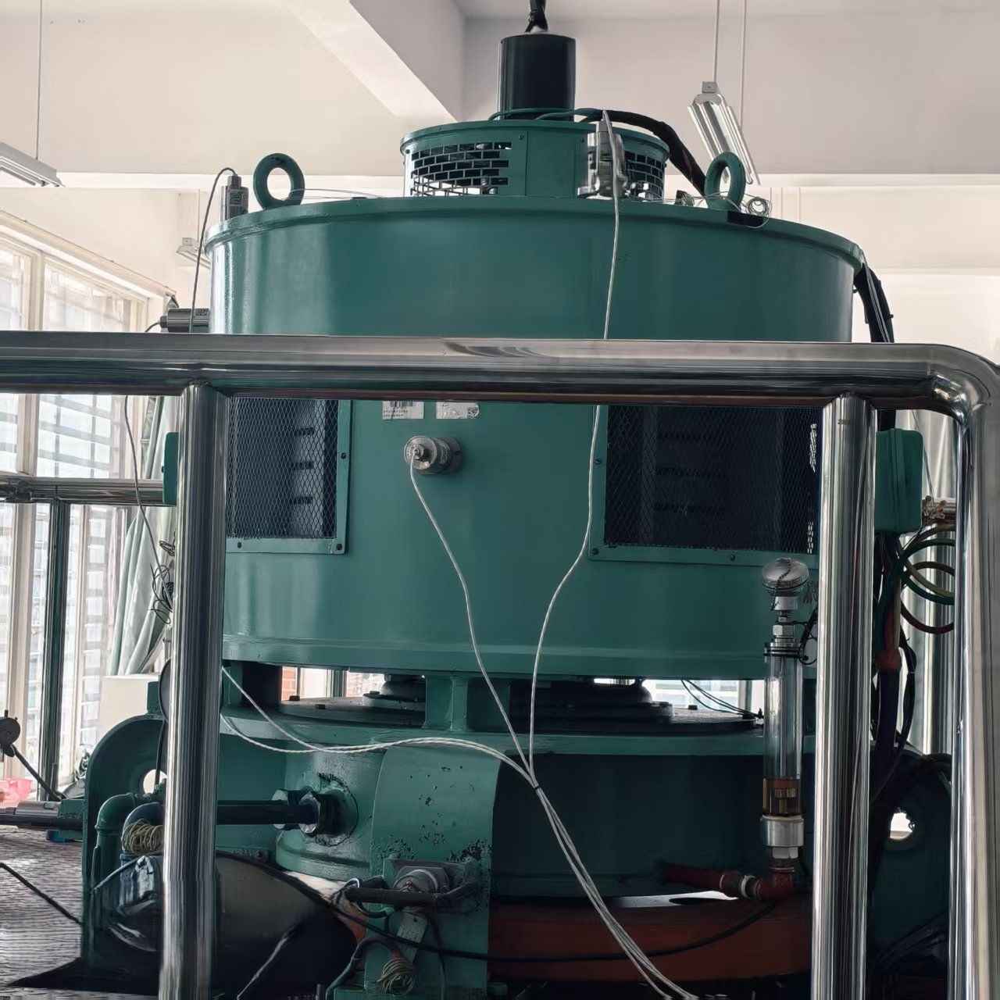
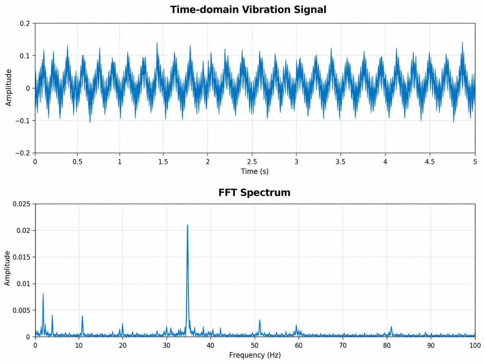
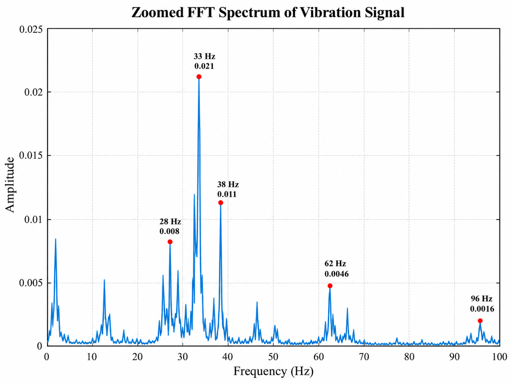
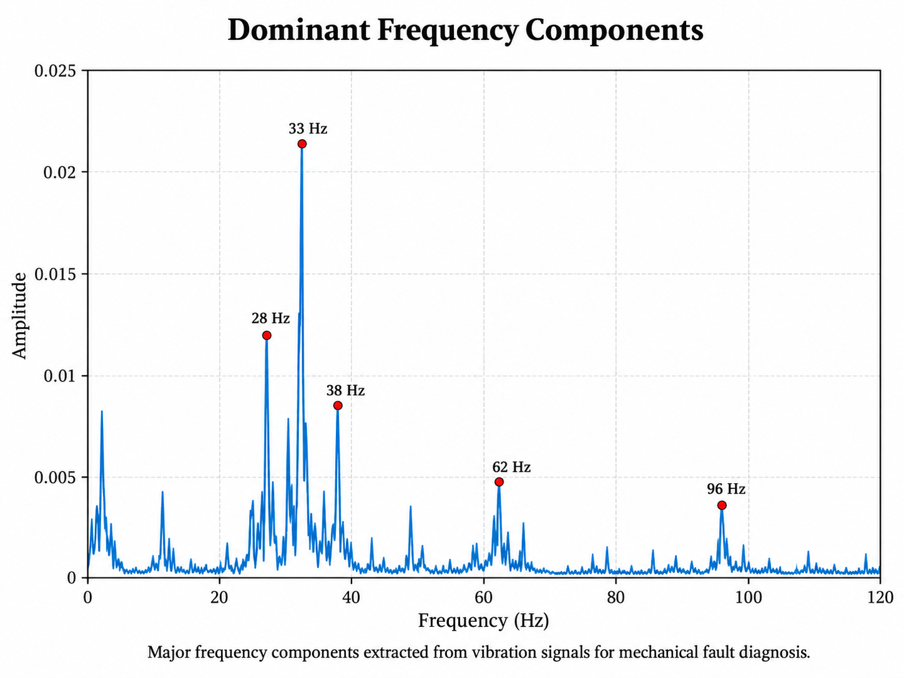

# Hydroturbine Blade Fault Diagnosis Research

## Overview

This project focuses on fault diagnosis of hydraulic turbine blade systems based on vibration signal analysis.

The objective is to identify structural faults through signal processing methods and extract effective fault-related features.

## Research Background

Hydraulic turbine rotating components may experience structural damage during long-term operation.

Early fault detection is important for improving equipment reliability and operational safety.

## Experimental Setup
The research uses vibration signals collected from a hydraulic turbine blade experimental platform.

The dataset includes:

- Normal operating conditions
- Fault conditions

## Methodology

The analysis workflow includes:

1. Vibration signal acquisition

2. Signal preprocessing

3. Time-frequency analysis

4. Feature extraction

5. Fault identification

## Tools

- MATLAB
- Signal Processing Toolbox
- Data visualization

## Research Contributions

- Development of vibration-based fault diagnosis methodology
- Analysis of fault characteristics in rotating machinery
- Evaluation of signal processing approaches

## Project Status

Research project in progress.
## Signal Processing Results

Vibration signals were analyzed using time-domain and frequency-domain methods.

Fast Fourier Transform (FFT) was applied to extract dominant frequency components and characterize vibration behavior.

### Time-domain and FFT Analysis

The vibration signal was first analyzed in the time domain and transformed into the frequency domain using Fast Fourier Transform (FFT).

### Detailed Frequency Characteristics

The low-frequency spectrum was further investigated to identify dominant vibration components.

### Dominant Frequency Components

Peak detection was used to extract representative frequency components from the vibration signal.

## Code

MATLAB implementation for vibration signal preprocessing and FFT-based frequency analysis.

The demo script includes:

- Signal preprocessing
- FFT calculation
- Frequency spectrum visualization
- Dominant frequency extraction

Code:

`code/fft_analysis_demo.m`
## Conclusion

This project demonstrates a vibration-based analysis workflow for hydroturbine blade fault diagnosis.

FFT-based frequency analysis was applied to extract dominant vibration characteristics, providing potential features for further fault classification and condition monitoring.
